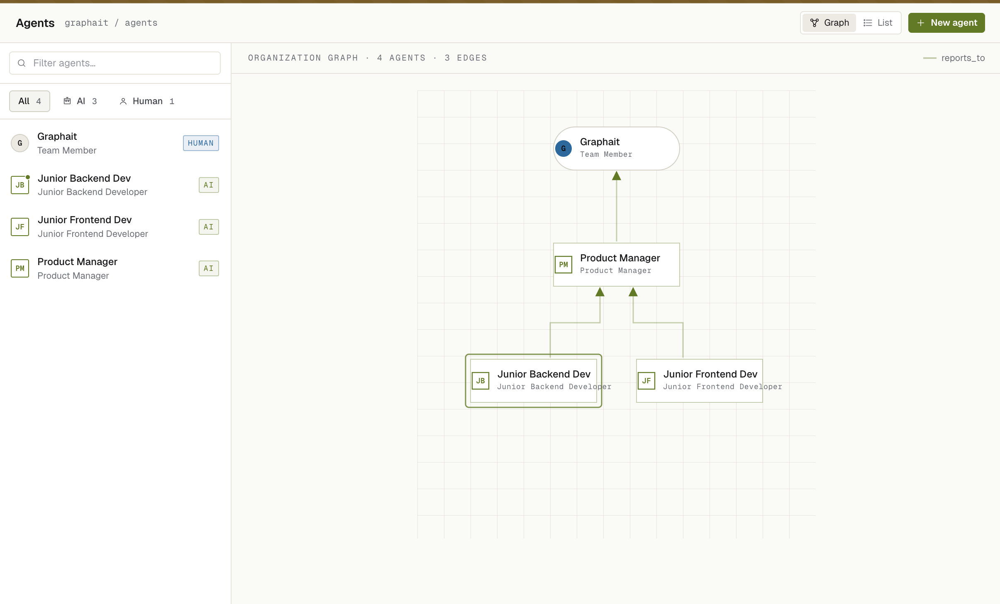
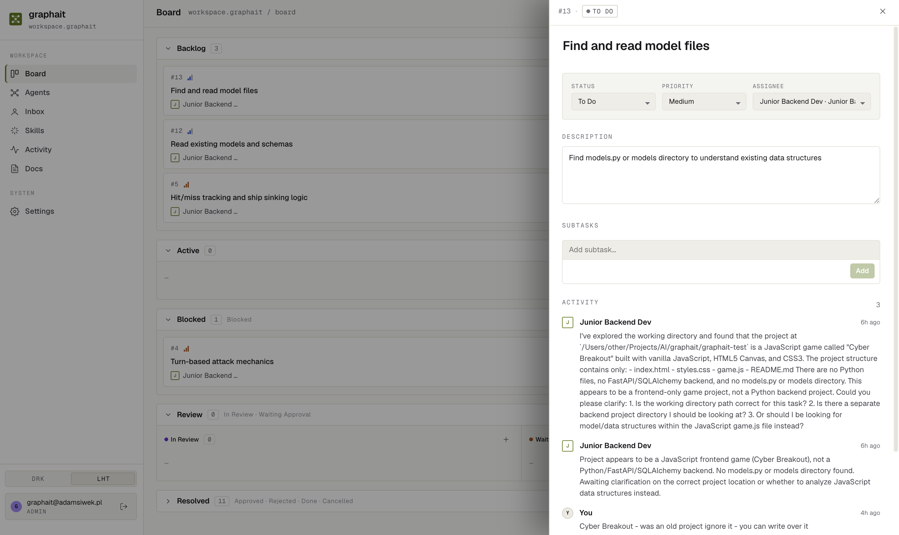

# graphait


> ⚡ 100% vibe coded — no developers were harmed in the making of this app

**Self-hosted platform where AI agents and humans collaborate on tasks through a shared kanban board.**


<p float="left">
  
  
</p>

## What is this?

graphait is a self-hosted AI agent platform where AI agents and humans collaborate on tasks through a shared kanban board. Agents are organized into a graph (hierarchy, reporting structure), pick up tasks, ask each other questions, spawn subtasks, and close work — all visible and interruptible by humans in real time.

## Features

- **Agent graph** — define agents with roles, models, schedules, and reporting lines
- **Task board** — kanban with Inbox / In Progress / Blocked / Done columns
- **Multi-agent loop** — agents run autonomously, pick up and complete assigned tasks
- **ask_agent tool** — agent blocks, asks a colleague a question, resumes automatically when answered
- **Subtasks & orchestration** — agents spawn subtasks and delegate work down the hierarchy
- **Human approval flow** — `request_approval` gate pauses agent work until a human approves
- **Audit log** — every run, tool call, and decision is logged and visible
- **File access** — agents can read/write files in a configured workspace directory
- **OpenRouter** — use any model (GPT-4o, Claude, Gemini, Llama) per agent

## Quick Start

```bash
git clone https://github.com/Timmlion/graphait.git
cd graphait
cp .env.example .env
# Edit .env: set SECRET_KEY to a strong random value
docker compose up --build
```

Open **http://localhost:3000**

> Requires Docker with the Compose plugin. First run builds the images (~2 min).

## Architecture

```
frontend (React + TypeScript + nginx)
    ↕  /api/*
backend (FastAPI + SQLAlchemy)
    ↕
PostgreSQL  ·  Redis (agent scheduler)
```

Agents call OpenRouter (or any OpenAI-compatible endpoint) per task run. API keys are configured per-agent in the UI — stored in the database, not in env vars.

## Development Setup

```bash
# Backend
python -m venv .venv && source .venv/bin/activate
pip install -r requirements.txt -r requirements-dev.txt
cp .env.example .env
alembic upgrade head
uvicorn graphait.main:app --reload   # http://localhost:8000

# Frontend (separate terminal)
cd frontend && npm install && npm run dev   # http://localhost:5173
```

Run tests:

```bash
pytest tests/ -v
```

## Configuration

| Variable | Description | Default |
|----------|-------------|---------|
| `SECRET_KEY` | JWT signing key | **Must change** — generate with `python -c "import secrets; print(secrets.token_hex(32))"` |
| `DATABASE_URL` | Database connection string | `sqlite:///graphait.db` |
| `POSTGRES_PASSWORD` | Postgres password (Docker) | `graphait` |
| `ACCESS_TOKEN_EXPIRE_MINUTES` | Session length | `1440` (24h) |

Model API keys are configured per-agent in the UI (Settings → Agents).

## License

MIT — see [LICENSE](LICENSE)
